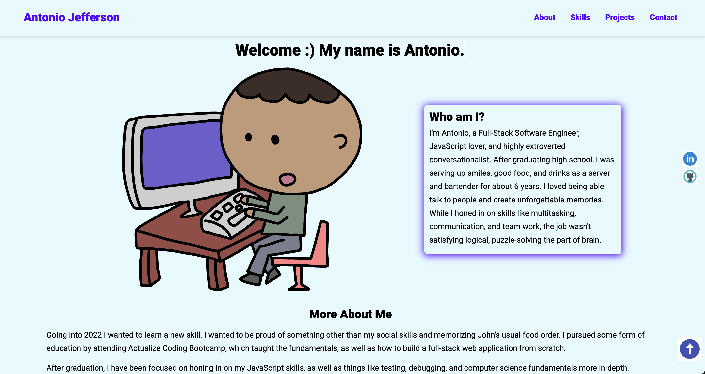

# DEVELOPER PORTFOLIO

Version 1 of my portfolio.

## Credit to

[@koladechris](https://www.twitter.com/koladechris) and freecodecamp.org

## Github repo

This is the [link](https://github.com/Ksound22/developer-portfolio) to the Github repo of the project

## Sample Website

A live demo is already available via this [link](https://eager-williams-af0d00.netlify.app/?)

## Tech Stack

**Client:** HTML, CSS, Vanilla JavaSCript

## Tools Used

Below are are list of tools used, and the precise things they were used for:

- [Ion Icons](https://ionic.io/ionicons) for hambuger menu bar
- [Drawkit](https://www.drawkit.io/) for Jane Doe illustration
- [Icon8](https://icons8.com/) for animated icons and skills icons
- [Animate CSS](https://animate.style/) for Jane Doe's bio text animation
- [Formspree](https://formspree.io/) for contact form submision and straight delivery to Gmail

## Acknowledgements

- [Awesome Readme Templates](https://awesomeopensource.com/project/elangosundar/awesome-README-templates)
- [Awesome README](https://github.com/matiassingers/awesome-readme)
- [How to write a Good readme](https://bulldogjob.com/news/449-how-to-write-a-good-readme-for-your-github-project)
